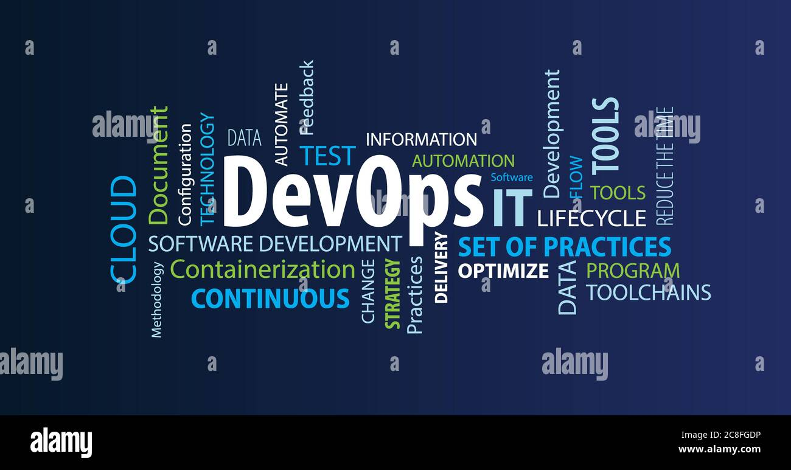

# About me

## Aloha, I'm Parth Vijay :wave: :man_technologist:

<!-- 
 
  Visitor count 
  

 -->

I am a DevOps Cloud Engineer. Over the years, I have gained a wide-ranging set of skills, qualities and attributes that, I believe, make me a competent, supportive, professional and flexible DevOps Engineer. In addition to possessing solid technical knowledge capabilities, I am also someone who has excellent communication, collaboration, and decision-making skills.

## Tech Stack:

- Language: Python
- Linux GNU Servers: Ubuntu, Red Hat Enterprise Linux, CentOS
- Configuration Management Tools: Ansible
- Containerization Tools: Docker, Kubernetes
- Version Control System: Git
- CI/CD Pipeline: using GitHub Actions, Jenkins, BitBucket, GitLab
- Cloud Computing: AWS, Google Cloud Platform, Azure, Digital Ocean, Heroku
- Monitoring Tools: ELK stack, Prometheus & Grafana
- Web Servers: Nginx, Apache2
- Database Server: Mysql, PostgreSQL

## Certification:

- Red Hat Certified System administrator
- Red Hat Certified Engineer

## Github Stats:

<!-- 
  -->

<!-- ## Get in touch :coffee:: 

- [Medium](https://parth-24073.medium.com/)
- [LinkedIn](https://www.linkedin.com/in/parth-vijay-131bb9189) -->

## Get in touch :coffee::

  

## Ask Me:

-  💬 Ask me about anything [here](https://github.com/parth1625/parth1625/issues)